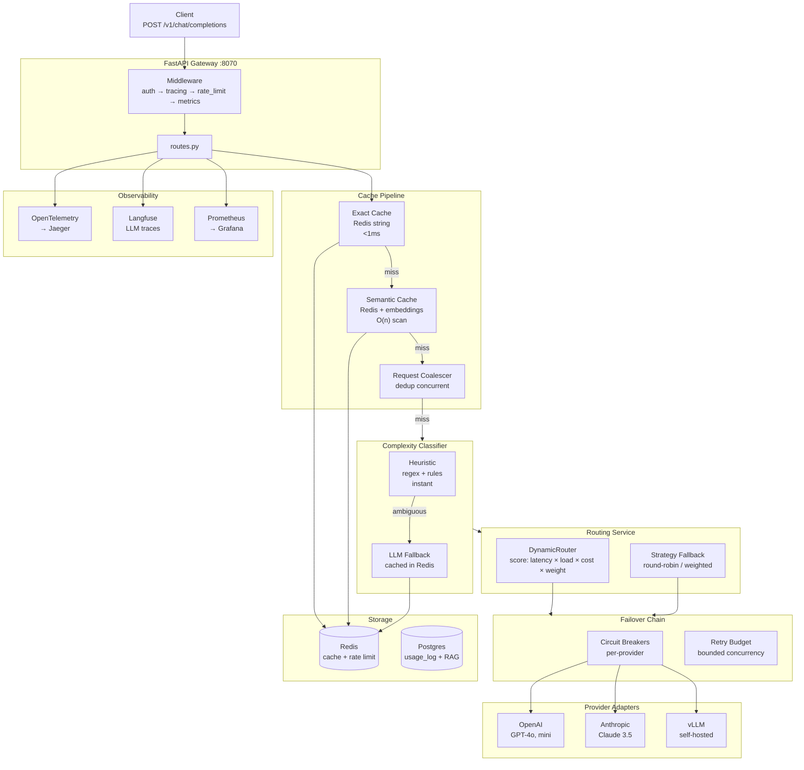

# InferRoute

**An intelligence-aware LLM routing gateway — one OpenAI-compatible API in front of OpenAI, Anthropic, Groq, and vLLM, with dynamic routing, two-tier caching, circuit breakers, and per-tenant rate limiting.**


[Live Architecture Walkthrough →](https://uiagent-sigma.vercel.app/architecture) · [AgentMesh (sister project)](https://github.com/Raushan0303/agent-mesh)

> Status: Weeks 1-13 complete. A 3-tier hybrid classifier (heuristic → Redis-cached LLM classification) routes prompts by complexity (simple → gpt-4o-mini, medium → Llama-3.3-70B, complex → GPT-4o); on a 60-prompt labeled mix that is an estimated 66.8% cheaper than sending everything to GPT-4o at list prices (`benchmarks/routing_cost.py`). A two-tier cache (exact-match + semantic cosine similarity with XFetch probabilistic TTL) plus request coalescing: exact hits measured at 0.3 ms p50 against Redis; semantic hits are an O(n) scan (≈4 ms at 10 entries, 33 ms at 100) plus the embedding call (`benchmarks/cache_latency.py`). Per-tenant Redis token buckets: in a noisy-neighbor benchmark, a quiet tenant's 429 rate went from 96% to 0% after fixing the middleware order (`benchmarks/tenant_spillover.py`). Per-call cost computation with split input/output token pricing returns `cost_usd` on every response.

### Three design decisions worth knowing before reading the code

1. **InferRoute owns pricing, the caller owns the budget.** Every provider is registered with split `cost_per_1k_input` / `cost_per_1k_output` rates (they're not the same — GPT-4o charges 4x more for output). InferRoute computes the actual `cost_usd` per call from real token counts and returns it in the response; callers (like AgentMesh) never maintain their own pricing table that goes stale when a provider changes rates.
2. **The router is application-agnostic by rule.** If a piece of code needs to know what an "agent" or a "workflow" is, it doesn't belong in InferRoute — it would work identically for a Temporal-orchestrated agent, a raw `curl` script, or a Jupyter notebook. This is what keeps the gateway reusable across projects.
3. **LLM-level tracing is a pluggable backend, not a Jaeger side-effect.** Distributed tracing (OpenTelemetry → Jaeger) shows the request path across services; Langfuse shows the LLM call itself — prompt, completion, tokens, cost, routing decision — as a first-class `TracingBackend` that can swap to LangSmith without touching call sites.

---

## Table of Contents

- [Quick Start](#quick-start)
- [Architecture Overview](#architecture-overview)
- [Folder Structure](#folder-structure)
- [How It Connects to AgentMesh](#how-it-connects-to-agentmesh)
- [Key Engineering Decisions](#key-engineering-decisions)
- [API Reference](#api-reference)
- [Test Results](#test-results)
- [Glossary](#glossary)
- [Tech Stack](#tech-stack)

---

## Quick Start

### Prerequisites

- Docker (for Redis + Postgres + Prometheus + Grafana)
- Python 3.11+
- `pip install -r requirements.txt`

### One-command setup (using Makefile)

```bash
# Terminal 1: infrastructure
make infra

# Terminal 2: gateway
make gateway
```

### Manual setup

```bash
# Terminal 1: infrastructure
docker compose up -d

# Terminal 2: gateway
source venv/bin/activate
uvicorn app.main:app --reload --port 8070
```

### Send a request

```bash
# Health check
curl http://localhost:8070/v1/health

# Chat completion (OpenAI-compatible)
curl -X POST http://localhost:8070/v1/chat/completions \
  -H "Content-Type: application/json" \
  -d '{
    "messages": [{"role": "user", "content": "What is 2+2?"}],
    "model": "auto"
  }'
```

### Run tests

```bash
# Full suite (142 tests)
make test
# or: python -m pytest tests/ -v

# By category
make test-routing     # 30 routing tests
make test-cache       # 25 cache tests
make test-resilience  # 11 circuit breaker + failover tests
make test-ratelimit   # 11 rate limiting tests
make test-rag         # 11 RAG tests
make test-mcp         # 11 MCP gateway tests
```

### View in Grafana / Prometheus

Open http://localhost:3000 (Grafana) or http://localhost:9090 (Prometheus) to see request metrics, circuit breaker states, and cache hit rates.

---

## Architecture Overview

```
Client (AgentMesh / curl / any app)
    │
    ▼
FastAPI Gateway ─────────────────── app/gateway/routes.py
    │ POST /v1/chat/completions
    │ Middleware: auth → tracing → rate_limit → metrics
    │
    ▼
Cache Pipeline ──────────────────── app/cache/pipeline.py
    ├── Exact-match cache (Redis string)     → <1ms for identical queries
    ├── Semantic cache (Redis + embeddings)  → O(n) scan + embedding call
    └── Request coalescer                    → dedup concurrent identical calls
    │
    │ [cache miss → continue]
    ▼
Complexity Classifier ───────────── app/routing/complexity_classifier.py
    ├── Heuristic (regex + rules)            → instant, no LLM call
    └── LLM fallback (cached in Redis)       → for ambiguous prompts
    │
    ▼
Routing Service ─────────────────── app/routing/routing_service.py
    ├── Mode 1: Config-based (dynamic scoring)
    │     DynamicRouter scores providers on: latency × load × cost × weight
    │     Returns ordered list, best provider first
    │
    └── Mode 2: Strategy-based (fallback)
          Round-robin / weighted / lowest-latency
    │
    ▼
Failover Chain ──────────────────── app/resilience/failover.py
    ├── For each provider in ordered list:
    │     Check circuit breaker (skip if OPEN)
    │     Acquire retry budget slot
    │     Call provider adapter
    │     If success → return
    │     If failure → next provider
    │
    └── All providers failed → 503
    │
    ▼
Provider Adapters ───────────────── app/adapters/
    ├── OpenAI adapter     (GPT-4o, GPT-4o-mini, etc.)
    ├── Anthropic adapter  (Claude 3.5 Sonnet, Haiku, etc.)
    └── vLLM adapter       (self-hosted, OpenAI-compatible)
    │
    ▼
Response ────────────────────────── app/gateway/models.py
    Returns: content + model + provider + usage + cost_usd + latency_ms
    Caches result in exact + semantic cache
    Records trace (OpenTelemetry + Langfuse)
    Records usage in Postgres (usage_log table)
```

<details>
<summary><b>Architecture diagram (Mermaid — rendered on GitHub)</b></summary>



</details>

### The six layers

| Layer | What it is | Owner | Key files |
|---|---|---|---|
| **Gateway** | FastAPI HTTP API, OpenAI-compatible | Platform | `app/gateway/` |
| **Cache** | Exact + semantic + coalescing | Platform | `app/cache/` |
| **Routing** | Complexity classification + dynamic scoring | Platform | `app/routing/` |
| **Resilience** | Circuit breakers, failover, retry budget | Platform | `app/resilience/` |
| **Rate Limiting** | Token bucket + fair queue + quotas | Platform | `app/ratelimit/` |
| **Observability** | OTel + Langfuse + Prometheus | Platform | `app/observability/` |

---

## Folder Structure

```
infer-route/
├── app/
│   ├── main.py                          # FastAPI app + lifespan (wires all components)
│   │
│   ├── gateway/                         # ── HTTP Gateway ──
│   │   ├── routes.py                    #   POST /v1/chat/completions, /v1/rag/*, /v1/mcp/*, /v1/health
│   │   ├── models.py                    #   InferRouteRequest/Response, OpenAI-compatible shapes
│   │   └── middleware.py               #   auth, tracing, rate_limit, metrics middleware
│   │
│   ├── routing/                         # ── Routing Engine ──
│   │   ├── routing_service.py           #   Main entry — config-based or strategy-based routing
│   │   ├── dynamic_router.py            #   Dynamic scoring: latency × load × cost × weight
│   │   ├── complexity_classifier.py     #   Heuristic-first, LLM-fallback complexity classification
│   │   ├── strategies.py                #   Round-robin, weighted, lowest-latency strategies
│   │   ├── provider_registry.py         #   Provider registration + health tracking
│   │   ├── config_registry.py           #   Per-tenant routing configs (Portkey-style)
│   │   ├── health_checker.py            #   Background health polling
│   │   └── cost.py                      #   Per-call cost computation from real token counts
│   │
│   ├── cache/                           # ── Two-Tier Cache ──
│   │   ├── pipeline.py                  #   Cache pipeline: exact → semantic → coalesce
│   │   ├── exact_cache.py               #   Exact-match cache (Redis string, O(1))
│   │   ├── semantic_cache.py            #   Semantic cache (embedding cosine similarity, XFetch TTL)
│   │   ├── coalescer.py                 #   Request coalescer (dedup concurrent identical calls)
│   │   └── embedding.py                 #   Embedding service for semantic cache
│   │
│   ├── resilience/                      # ── Fault Tolerance ──
│   │   ├── circuit_breaker.py           #   Per-provider circuit breaker (CLOSED → OPEN → HALF_OPEN)
│   │   ├── failover.py                  #   FailoverChain — tries providers in order, skips OPEN breakers
│   │   └── retry_budget.py              #   Bounded retry concurrency (prevents retry storms)
│   │
│   ├── ratelimit/                       # ── Rate Limiting ──
│   │   ├── token_bucket.py              #   Redis Lua token bucket (atomic, per-tenant)
│   │   ├── quota.py                     #   Per-tenant token quota enforcement
│   │   └── fair_queue.py                #   Weighted fair queue (per-tenant concurrency)
│   │
│   ├── adapters/                        # ── Provider Adapters ──
│   │   ├── base.py                      #   Base adapter interface
│   │   ├── openai.py                    #   OpenAI adapter
│   │   ├── anthropic.py                 #   Anthropic adapter
│   │   └── vllm.py                      #   vLLM adapter (self-hosted, OpenAI-compatible)
│   │
│   ├── rag/                             # ── RAG (shared with AgentMesh) ──
│   │   ├── rag_service.py               #   Query + upsert + cache
│   │   ├── retriever.py                 #   Hybrid retriever (BM25 + dense + RRF)
│   │   ├── store.py                     #   pgvector vector store
│   │   └── embeddings.py                #   Embedding service
│   │
│   ├── mcp/                             # ── MCP Tool Gateway ──
│   │   ├── gateway.py                   #   Invoke external MCP tools with circuit breakers
│   │   └── registry.py                  #   Tool registration + discovery
│   │
│   ├── experiments/                     # ── A/B Testing ──
│   │   ├── ab_router.py                 #   Hash-based A/B routing
│   │   ├── shadow_traffic.py            #   Shadow traffic (call challenger without affecting user)
│   │   └── drift_detector.py            #   Async drift detection between champion and challenger
│   │
│   ├── evals/                           # ── Evaluation ──
│   │   ├── feedback.py                  #   Thumbs up/down storage + stats
│   │   └── side_by_side.py              #   Side-by-side comparison of two providers
│   │
│   ├── observability/                   # ── Observability ──
│   │   ├── tracing.py                   #   W3C traceparent propagation + TracingContext
│   │   ├── tracing_backend.py           #   Pluggable backend (Jaeger, Langfuse, LangSmith)
│   │   └── metrics.py                   #   Prometheus metrics (request_total, duration, cache hits)
│   │
│   └── core/                            # ── Shared Config ──
│       ├── config.py                    #   Settings via pydantic-settings (INFERROUTE_ prefix)
│       ├── constants.py                 #   Redis key prefixes, circuit breaker states
│       └── database.py                  #   asyncpg pool + usage_log persistence
│
├── tests/                               # 142 tests across all modules
│   ├── routing/                         #   30 tests — strategies, dynamic scoring, cost, health
│   ├── cache/                           #   25 tests — exact, semantic, coalescer, pipeline
│   ├── resilience/                      #   11 tests — circuit breaker, failover, retry budget
│   ├── ratelimit/                       #   11 tests — token bucket, quota, fair queue
│   ├── rag/                             #   11 tests — store, retriever, service
│   ├── mcp/                             #   11 tests — gateway, registry
│   ├── gateway/                         #   10 tests — routes, RAG chat
│   ├── observability/                   #   10 tests — tracing, W3C propagation
│   ├── experiments/                     #   13 tests — A/B router, shadow, drift
│   ├── evals/                           #   8 tests — feedback, side-by-side
│   └── adapters/                        #   2 tests — translation
│
├── docker-compose.yml                   # Redis + Postgres + Prometheus + Grafana
├── Makefile                             # make infra, make gateway, make test, etc.
├── requirements.txt
└── docs-infer-route/                    # HLD/LLD, API reference, tracing docs
```

---

## How It Connects to AgentMesh

InferRoute is the inference layer underneath [AgentMesh](https://github.com/Raushan0303/agent-mesh). They are two repos that form one platform:

```
AgentMesh (agent orchestration)
    │
    │  calls LLM via InferRoute's OpenAI-compatible API
    │  POST http://localhost:8070/v1/chat/completions
    │
    ▼
InferRoute (inference serving)
    │  routes to cheapest capable provider
    │  caches repeated queries
    │  enforces rate limits + circuit breakers
    │  returns cost_usd per call
    │
    ▼
OpenAI / Anthropic / vLLM
```

**What they share:**
- **pgvector RAG backend** — both repos talk to the same Postgres + pgvector instance for vector search
- **Redis** — InferRoute uses it for caching + rate limiting; AgentMesh uses it for semantic cache + Pub/Sub
- **MCP tool layer** — both repos can invoke the same registered MCP tools

**What they don't share:**
- AgentMesh owns agent logic (LangGraph, Temporal, tool registry, evals)
- InferRoute owns inference logic (routing, caching, rate limiting, failover)

**Why they're separate:**
AgentMesh optimizes for **correctness** (did the agent do the right thing?). InferRoute optimizes for **efficiency** (did we serve the request cheaply and fast?). Mixing them would mean mixing two different optimization targets in the same codebase. See [the origin story blog post](https://github.com/Raushan0303/agent-mesh/blob/main/blog/00-why-i-built-this.md) for the full reasoning.

---

## Key Engineering Decisions

### 1. Why heuristic-first complexity classification?

The complexity classifier has two tiers:

1. **Heuristic** (regex + rules) — instant, no LLM call. Catches obvious cases: greetings, basic math, yes/no questions → "simple". Code generation, system design → "complex". Everything else → "medium".
2. **LLM fallback** (cached in Redis for 1 hour) — for ambiguous prompts the heuristic can't classify confidently. The LLM classifier returns `{"complexity": "simple|medium|complex", "confidence": 0.0-1.0}`. If confidence < 0.7, we fall back to "medium".

**Why not just use the LLM classifier for everything?** Because it costs money and adds latency. 70% of prompts are classifiable by heuristic. The LLM classifier only fires for the 30% the heuristic can't handle. And those LLM classifications are cached — the same prompt never gets classified twice.

**Measured (estimate, not billed spend):** `python -m benchmarks.routing_cost` runs 60 labeled prompts through the real classifier and strategy and prices them at list prices: routed = 66.8% cheaper than all-GPT-4o, but 5.5× the cost of all-gpt-4o-mini. Input tokens ≈ chars/4, output length assumed per class, answer quality not measured; the heuristic classifier sent 12 of 20 complex prompts to the medium tier. Prices are per 1M tokens, priced by the model that served the call (`app/routing/pricing.py`).

### 2. Why two cache tiers (exact + semantic)?

| Cache | What it catches | Latency | Hit rate |
|---|---|---|---|
| **Exact-match** | Identical query strings | <1ms | ~15% |
| **Semantic** | Similar queries (cosine similarity ≥ 0.95) | O(n) scan: 4 / 33 / 327 ms p50 at 10 / 100 / 1000 entries, + embedding call | not measured |

The exact cache is a simple Redis string lookup — O(1), sub-millisecond. It catches the case where two users ask the exact same question.

The semantic cache uses embedding cosine similarity. "What's the weather?" and "What's the weather like?" hit the same cache entry. This catches the 25% of queries that are semantically identical but textually different.

**XFetch probabilistic TTL:** The semantic cache uses XFetch — instead of a hard TTL, each entry has a probabilistic freshness check. On a cache hit, there's a small probability of revalidating with the upstream. This prevents stale entries from serving outdated answers while avoiding the thundering herd of simultaneous expirations.

**Request coalescing:** If two users ask the same question at the same time (cache miss for both), only one upstream call is made. The second request awaits the first's result via `asyncio.Future`. This cuts duplicate concurrent calls to zero.

### 3. Why dynamic scoring instead of static round-robin?

Round-robin treats all providers as equal. They're not. A provider that's currently slow (high latency) or overloaded (high in-flight count) should get fewer requests. A provider that's cheap should get more (for simple queries).

The `DynamicRouter` scores each provider:

```
score = (1 / latency) × (1 / (1 + in_flight)) × (1 / cost) × weight
```

- **Latency** — EWMA of recent response times. Fast providers score higher.
- **Load** — current in-flight request count. Unloaded providers score higher.
- **Cost** — per-1K-token pricing. Cheap providers score higher.
- **Weight** — manual override for business preferences (e.g., "prefer OpenAI 2x over Anthropic").

The providers are ordered by score, and the failover chain tries them in that order. If the top provider's circuit breaker is OPEN, it's skipped and the next provider is tried.

### 4. Why per-provider circuit breakers?

Without circuit breakers, if OpenAI goes down, every request to OpenAI times out (30s each), then fails over to Anthropic. With 100 concurrent requests, that's 100 × 30s = 50 minutes of wasted time waiting for timeouts.

With circuit breakers, after 5 consecutive failures, OpenAI's breaker goes OPEN. All subsequent requests skip OpenAI instantly (no timeout wait) and go straight to Anthropic. The breaker goes HALF_OPEN after 30 seconds — one test request is sent. If it succeeds, the breaker closes. If it fails, it stays OPEN.

**Result:** failover from a down provider happens in <1ms instead of 30s.

### 5. Why Redis Lua for token bucket rate limiting?

Rate limiting must be atomic. If two requests arrive at the same time and both read "tokens remaining = 1", both will consume it, and the bucket goes to -1. That's a race condition.

The token bucket implementation uses a Redis Lua script that does the read-check-write in a single atomic operation. Redis executes Lua scripts atomically — no other command can interleave. This guarantees correctness under concurrent access.

**Per-tenant isolation:** Each tenant has its own bucket (`rate_limit:{tenant_id}:tokens`). Tenant A hitting their limit doesn't affect Tenant B. The fair queue adds weighted concurrency limits on top — Tenant A can't monopolize all concurrent slots even if they have rate limit budget remaining.

### 6. Why split input/output token pricing?

Most providers charge different rates for input vs. output tokens. GPT-4o charges $2.50/1K input but $10.00/1K output — 4x more. If you average them, you're wrong on every call that's input-heavy or output-heavy.

InferRoute stores `cost_per_1k_input` and `cost_per_1k_output` separately for each provider. After a call completes, it computes:

```python
cost_usd = (input_tokens / 1000 * cost_per_1k_input) + (output_tokens / 1000 * cost_per_1k_output)
```

This `cost_usd` is returned in every response and persisted to the `usage_log` table. Callers (like AgentMesh) use it to enforce per-workflow cost ceilings — "stop the workflow if total cost exceeds $5" — without maintaining their own pricing table.

---

## Measured results

Every number below has a script; results are saved under `benchmarks/results/`.

| What | Result | Reproduce |
|---|---|---|
| Noisy-neighbor rate limiting | quiet tenant 429s: 96% → 0% after the middleware-order fix | `python -m benchmarks.tenant_spillover --label after` (Redis on :6390) |
| Exact cache hit | 0.30 ms p50, 1.1 ms p99 (local Redis) | `python -m benchmarks.cache_latency` |
| Semantic cache hit (excl. embedding call) | 3.9 / 33 / 327 ms p50 at 10 / 100 / 1000 entries | `python -m benchmarks.cache_latency` |
| Complexity routing cost (estimate) | 66.8% cheaper than all-GPT-4o; 5.5× all-gpt-4o-mini | `python -m benchmarks.routing_cost` |
| A/B provider swaps | logged per swap with the stats behind it | `GET /v1/experiments/swaps` |

## API Reference

Base URL: `http://localhost:8070`

### Core endpoints

| Method | Path | Description |
|---|---|---|
| `POST` | `/v1/chat/completions` | Chat completion (OpenAI-compatible) |
| `POST` | `/v1/embeddings` | Generate embeddings |
| `GET` | `/v1/health` | Gateway liveness + provider health |
| `GET` | `/v1/usage` | Usage stats (tokens, cost, per-provider breakdown) |

### RAG endpoints

| Method | Path | Description |
|---|---|---|
| `POST` | `/v1/rag/query` | Query the RAG store (hybrid retrieval) |
| `POST` | `/v1/rag/upsert` | Insert/update documents in the RAG store |

### MCP endpoints

| Method | Path | Description |
|---|---|---|
| `GET` | `/v1/mcp/tools` | List registered MCP tools |
| `POST` | `/v1/mcp/servers/register` | Register an MCP server: `tools/list` discovers its tools |
| `POST` | `/v1/mcp/tools/{name}/register` | Register a replica for one tool |
| `POST` | `/v1/mcp/tools/{name}/invoke` | `tools/call` on a healthy replica (per-replica breakers, failover) |

### Routing config endpoints

| Method | Path | Description |
|---|---|---|
| `GET` | `/v1/routing/configs` | List routing configs for a tenant |
| `POST` | `/v1/routing/configs` | Create/update a routing config |
| `GET` | `/v1/routing/configs/{id}` | Get a specific routing config |
| `DELETE` | `/v1/routing/configs/{id}` | Delete a routing config |

### Experiment endpoints

| Method | Path | Description |
|---|---|---|
| `GET` | `/v1/experiments/stats` | A/B experiment stats + drift detection |
| `POST` | `/v1/feedback` | Submit thumbs up/down feedback |
| `GET` | `/v1/feedback/stats` | Feedback aggregate stats |

### POST /v1/chat/completions

```bash
curl -X POST http://localhost:8070/v1/chat/completions \
  -H "Content-Type: application/json" \
  -H "x-tenant-id: my-tenant" \
  -d '{
    "messages": [
      {"role": "user", "content": "Explain how TCP works in 3 sentences."}
    ],
    "model": "auto",
    "max_tokens": 200,
    "temperature": 0.7
  }'
```

**Response:**

```json
{
  "id": "chatcmpl-abc123",
  "object": "chat.completion",
  "created": 1724736000,
  "model": "gpt-4o-mini",
  "choices": [
    {
      "index": 0,
      "message": {
        "role": "assistant",
        "content": "TCP is a reliable, ordered delivery protocol..."
      },
      "finish_reason": "stop"
    }
  ],
  "usage": {
    "input_tokens": 42,
    "output_tokens": 87,
    "cost_usd": 0.000218
  },
  "provider": "openai",
  "latency_ms": 823.4,
  "cache_hit": false,
  "routing_decision": "strategy:round_robin",
  "complexity": "medium"
}
```

The response is OpenAI-compatible (same `choices` / `usage` shape) but adds:
- `provider` — which provider served the request
- `cost_usd` — actual cost computed from real token counts
- `cache_hit` — whether the response came from cache
- `routing_decision` — how the provider was selected
- `complexity` — the classifier's verdict (simple/medium/complex)

---

## Test Results

### Full suite: 142 tests

| Category | Tests | What they cover |
|---|---|---|
| **routing** | 30 | Round-robin, weighted, lowest-latency, dynamic scoring, cost computation, health checker |
| **cache** | 25 | Exact cache hit/miss, semantic cache cosine similarity, coalescer dedup, pipeline integration |
| **experiments** | 13 | A/B router hash distribution, shadow traffic, drift detection |
| **resilience** | 11 | Circuit breaker CLOSED→OPEN→HALF_OPEN, failover chain, retry budget |
| **ratelimit** | 11 | Token bucket atomicity, quota enforcement, fair queue weighting |
| **rag** | 11 | Vector store CRUD, hybrid retrieval (BM25 + dense + RRF), RAG service caching |
| **mcp** | 11 | Tool registration, invocation, circuit breaker per tool replica |
| **gateway** | 10 | Route handlers, RAG chat endpoint, error handling |
| **observability** | 10 | W3C traceparent propagation, span creation, LLM trace attributes |
| **evals** | 8 | Feedback storage, side-by-side comparison |
| **adapters** | 2 | Provider translation |

```bash
$ make test
========================= 142 passed in 3.42s =========================
```

---

## Glossary

**Intelligence-aware routing** — Classifying a prompt's complexity before routing it. Simple prompts go to cheap models (GPT-4o-mini, Haiku). Complex prompts go to premium models (GPT-4o, Claude 3.5 Sonnet). This cuts cost without cutting quality — a greeting doesn't need GPT-4o.

**Exact cache** — Redis string lookup keyed by the exact prompt text. O(1), sub-millisecond. Catches identical repeated queries.

**Semantic cache** — Redis + embedding cosine similarity. Catches queries that are semantically identical but textually different ("What's the weather?" vs "What's the weather like?"). Uses XFetch probabilistic TTL for freshness.

**Request coalescing** — If two clients send the same query at the same time (both cache misses), only one upstream call is made. The second client awaits the first's result. Cuts duplicate concurrent calls to zero.

**Circuit breaker** — A reliability pattern that stops calling a failing provider after N consecutive failures. CLOSED (normal) → OPEN (fail fast, don't call) → HALF_OPEN (one test call to check recovery). Prevents cascading failures and eliminates timeout waits on down providers.

**Failover chain** — An ordered list of providers to try. If the first provider fails (or its circuit breaker is OPEN), the next provider is tried. Continues until one succeeds or all fail.

**Token bucket** — A rate limiting algorithm. The bucket has a capacity and a refill rate. Each request consumes tokens. If the bucket is empty, the request is rejected. Implemented as a Redis Lua script for atomicity.

**Weighted fair queue** — A concurrency limiter that gives each tenant a weighted share of concurrent request slots. Prevents one tenant from monopolizing all slots.

**Dynamic scoring** — Real-time provider scoring based on latency (EWMA), load (in-flight count), cost (per-1K tokens), and manual weight. The highest-scoring provider is tried first.

**XFetch** — A probabilistic cache freshness algorithm. Instead of a hard TTL, each cache hit has a small probability of revalidating with the upstream. Prevents thundering herd on mass expiration while keeping entries fresh.

**MCP (Model Context Protocol)** — A protocol for connecting AI models to external tools. InferRoute's MCP gateway is an MCP client (official `mcp` SDK, Streamable HTTP): it discovers tools with `tools/list` and invokes them with `tools/call`, adding per-replica circuit breakers and failover.

---

## Tech Stack

| Component | Technology | Why |
|---|---|---|
| HTTP API | FastAPI + Uvicorn | Async, Pydantic-native, OpenAI-compatible |
| Cache | Redis (redis-stack) | Sub-ms exact cache, vector search for semantic cache |
| Database | PostgreSQL 15 + pgvector | Usage logging, RAG vector store |
| Rate limiting | Redis Lua scripts | Atomic token bucket under concurrent access |
| Metrics | Prometheus + Grafana | Request rate, latency, cache hits, circuit breaker state |
| Tracing | OpenTelemetry + Jaeger | Distributed traces across InferRoute → provider |
| LLM tracing | Langfuse | Prompt/completion/cost/tokens as first-class traces |
| Schema | Pydantic v2 | Request/response validation, settings management |
| DB driver | asyncpg | Fast async PostgreSQL access |
| Testing | pytest + pytest-asyncio | 142 tests across all modules |

---

## License

This project is part of a personal portfolio. See the repository for details.
